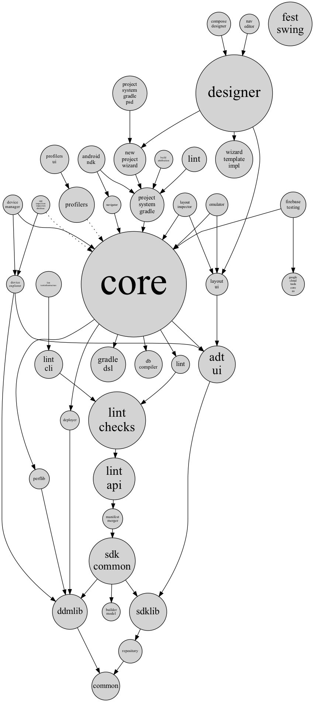

Dependency diagrams for the Android Studio codebase
===

Use `visualize-iml-deps.py` to visualize .iml module dependencies.
To run it you may need to install a few Python libraries like `networkx` and `pydot`.

Usage example
---
This is the command used to produce `example.png`:
```
./visualize-iml-deps.py \
    $SRC/tools/adt/idea/.idea/modules.xml \
    --transitive-reduction \
    --count-lines \
    --draw-to-scale \
    --num-modules 40 \
    --exclude '*aswb*' \
    --out example.png
```

Use `--help` to see all available options.

Important notes:

* If you use `--transitive-reduction`, then some dependency edges will be
  hidden in order to improve readability. Specifically, we hide all edges
  which are already implied by transitivity.

* If you use `--num-modules N`, then only the largest `N` modules will be shown.
  All other modules will be removed. Transitive dependency paths are
  preserved and are represented by dotted edges.

Tip: to share diagrams internally, use `--format dot` and upload the result
to Google's internal GraphViz server: http://graphviz.


Details
---
If you try to build a dependency diagram using Bazel:
```
$ bazel cquery 'kind(_iml_module_, deps(//tools/adt/idea/studio:android-studio))' --output=graph
```
then the result is too large and completely unreadable.

So instead we do the following:
* Quantify module size by counting lines of code (`--count-lines`).
* Draw modules as circles with area proportional to module size (`--draw-to-scale`).
* Hide small modules, test modules, and ASwB modules (`--num-modules 40 --exclude '*aswb*'`).
    * And add dotted edges where needed to preserve transitive dependency paths.
* Use [transitive reduction](https://en.wikipedia.org/wiki/Transitive_reduction)
  to hide edges that are already implied by transitivity (`--transitive-reduction`).
* Shorten module names by removing common prefixes.


Example diagram
---

