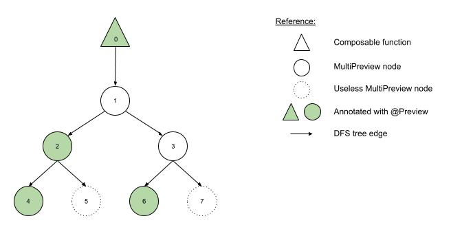

# MultiPreviewUsageTrackerTest

Some tests in `MultiPreviewUsageTrackerTest` consist of collecting the data of a MultiPreview graph and check
that the result is the expected one. Then, the purpose of this document is to provide images of the graphs
used in such tests, to make it easier for everyone to understand them.

## testLogEvent_tree

The MultiPreview graph for this test is a binary tree of height 3 where every left child is annotated with
@Preview

## testLogEvent_DAG

Different Composable functions define different MultiPreview graphs. Even though these graphs could have
some shared sub-graphs, the traversal for each Composable is completely independent of others.

In this test, the two Composable methods share a small sub-graph, and both are DAGs (Direct Acyclic Graph)

## testLogEvent_withCycle

The MultiPreview graphs for this test are similar to the ones in the previous test, but now they have a
shared sub-graph which consist of two mixed cycles.

(Pay attention to the clarifications)

