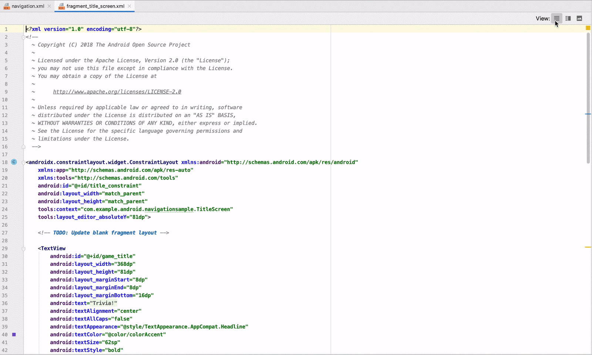
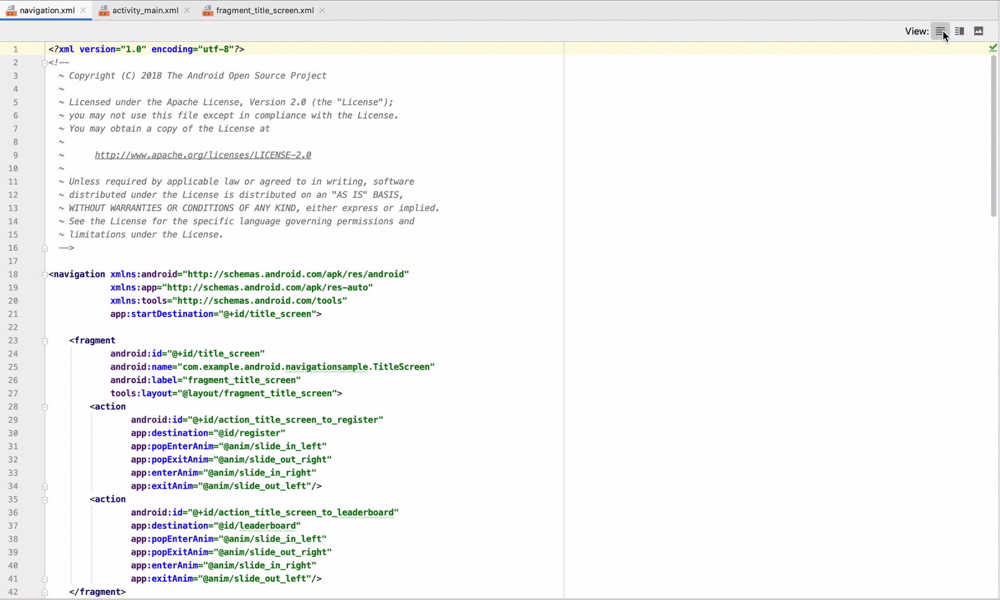

## Android Studio Design Tools Split Editor: Test Plan

### Author: amaurym@

## Overview

The new split editor introduced in Android Studio Design Tools replaces the former dual editor (text + design) paradigm. The flag was enabled in Android Studio 3.6 Canary 7, and we plan to improve the feature in future releases. This document proposes a test plan for the current version.

Figures 1 and 2 illustrate how the split editor looks like in comparison to the two tabs (“Text” and “Design”) we use to have for layout and navigation editors, respectively. Please note we use the top-right buttons to change mode instead of using the former tabs.

## Tests (All tests passed in canary 11)

### Layout Editor: New Project

1.  Create a new project with empty activity
1.  Open the activity_main.xml file created and wait for sync to finish
1.  __Expected result__: file is open in the new split editor. Make sure you can use the buttons on the top-right corner to change the editor mode to “Text”, “Design” and “Split” views.

### Navigation Editor: New Project

1.  Create a new project with basic activity
1.  Open the nav_graph.xml file created and wait for sync to finish
1.  __Expected result__: file is open in the new split editor. Make sure you can use the buttons on the top-right corner to change the editor mode to “Text”, “Design” and “Split” views.

### Layout Editor: Component Selection

1.  Create a new project with empty activity
1.  Open the activity_main.xml file created and wait for sync to finish
1.  Select the “Split” mode from the top-right corner (middle button)
1.  Drag a Button from the palette to the surface, so the layout contains a TextView and a Button
1.  On the text portion of the editor, select the &lt;TextView&gt; tag
1.  __Expected result__: TextView gets selected on the visual part of the editor
1.  On the text portion of the editor, select the &lt;Button&gt; tag
1.  __Expected result__: Button gets selected on the visual part of the editor
1.  On the visual part of the editor, select the TextView
1.  __Expected result__: &lt;TextView&gt; tag gets highlighted on the text part of the editor
1.  On the visual part of the editor, select the Button
1.  __Expected result__: &lt;Button&gt; tag gets highlighted on the text part of the editor

### Navigation Editor: Component Selection

1.  Create a new project with basic activity
1.  Open the nav_graph.xml file created and wait for sync to finish
1.  Select the “Split” mode from the top-right corner (middle button)
1.  On the text portion of the editor, select one a &lt;fragment&gt; tag
1.  __Expected result__: The fragment gets selected on the visual part of the editor
1.  On the text portion of the editor, select an &lt;action&gt; tag
1.  __Expected result__: The action arrow gets selected on the visual part of the editor
1.  On the visual part of the editor, select an unselected fragment
1.  __Expected result__: &lt;fragment&gt; tag corresponding to the fragment selected gets highlighted on the text part of the editor
1.  On the visual part of the editor, right-click SecondFragment and select Move To Nested Graph > New Graph
1.  On the text portion of the editor, select the SecondFragment &lt;fragment&gt; tag
1.  __Expected result__: The nested graph gets expanded on the visual portion of the editor and SecondFragment is displayed

### Layout Editor: Go to XML

1.  Create a new project with empty activity
1.  Open the activity_main.xml file created and wait for sync to finish
1.  Select the “Split” mode from the top-right corner (middle button)
1.  On the visual part of the editor, right-click the TextView and select “Go to XML” (or press Ctrl/Cmd + B).
1.  __Expected result__: Caret moves to the &lt;TextView&gt; tag on the text portion of the editor
1.  Select the “Design” mode from the top-right corner (the one on the right)
1.  Right-click the text view and select “Go to XML” (or press Ctrl/Cmd + B).
1.  __Expected result__: Editor changes mode to “Text” and caret moves to the &lt;TextView&gt; tag

### Navigation Editor: Go to XML

1.  Create a new project with basic activity
1.  Open the nav_graph.xml file created and wait for sync to finish
1.  Select the “Split” mode from the top-right corner (middle button)
1.  On the visual part of the editor, right-click FirstFragment and select “Go to XML” (or press Ctrl/Cmd + B).
1.  __Expected result__: Caret moves to the &lt;fragment&gt; tag with id @+id/FirstFragment on the text portion of the editor
1.  Select the “Design” mode from the top-right corner (the one on the right)
1.  Right-click SecondFragment and select “Go to XML” (or press Ctrl/Cmd + B).
1.  __Expected result__: Editor changes mode to “Text” and caret moves to the &lt;fragment&gt; tag with id @+id/SecondFragment

### Navigation Editor: Jump to Layout File

1.  Create a new project with basic activity
1.  Open the nav_graph.xml file created and wait for sync to finish
1.  Select the “Split” mode from the top-right corner (middle button)
1.  On the visual part of the editor, double-click FirstFragment
1.  __Expected result__: fragment_first.xml is open

### Drawables: Adaptive Icon

1.  Create a new project with empty activity
1.  Open the ic_launcher.xml file created and wait for sync to finish
1.  Select the “Split” mode from the top-right corner (middle button)
1.  On the toolbar on the visual part of the editor, change the density to mdpi
1.  __Expected result__: quality of the drawable gets considerably worse
1.  On the same toolbar, change the density to xxxhdpi
1.  __Expected result__: quality of the drawable gets considerably better
1.  On the toolbar, change the icon format from Square to Circle
1.  __Expected result__: icon is drawn as a circle

### Drawables: Vector

1.  Create a new project with empty activity
1.  Open the ic_launcher_foreground.xml file created and wait for sync to finish
1.  Select the “Split” mode from the top-right corner (middle button)
1.  Use the zoom controls on the visual part of the editor
1.  __Expected result__: vector zooms in/out depending on the zoom controls used

### Drawables: Fonts

1.  Create a new project with empty activity
1.  Create a new font resource directory and download/extract [these files](https://drive.google.com/file/d/1gEOBPDX-UDaCgf1wf8l9kimDjCyoRvJP/view?usp=sharing) there
1.  Open the my_font.xml file downloaded
1.  Select the “Split” mode from the top-right corner (middle button)
1.  __Expected result__: three different fonts are rendered in the visual part of the editor, vertically stacked
1.  Use the zoom controls on the visual part of the editor
1.  __Expected result__: fonts zoom in/out depending on the zoom controls used

## Related documents

*   [go/nele-split-editor](go/nele-split-editor)
*   [go/split-editor-metrics](go/split-editor-metrics)